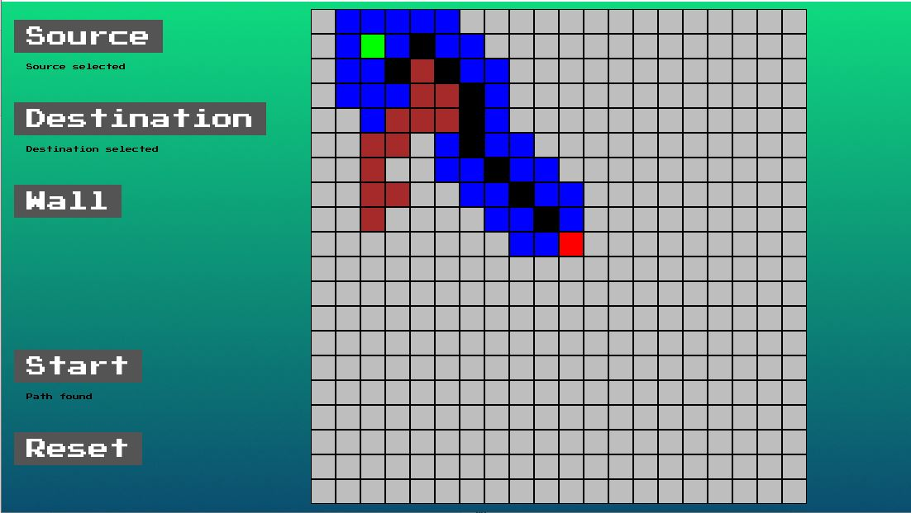

# Algorithm Visualizer

This is a game written in Python to show visualization of popular algorithms. Currently, A star algorithm is visualized to find shortest path in this game with more addition incoming.

### Tech stack used:

- Python (3:10)
- Pygame
- Figma to create any background, button images

## How to play?

- Clone the github repository.

```
    git clone https://github.com/LINSANITY03/Algorithm_Visualizer.git
```

- Create a virutal env and install the requirements.

```
    python virtualenv venv
    venv\Scripts\active
    pip install -r requirements.txt
```

- Run the AlgoMain.py file.

```
    python AlgoMain.py
```

## Rules:

- Source and destination points are required to start.
- Walls can be selected multiple times or None.
- A \* algorithm can search in all 8 directions representing straight and diagonals cells.
- Green colour represents source.
- Red colour represents Destination.
- Brown colour represents walls.
- Blue colour represents visited cell.
- Path if existed is represented by Black colour

## Output:

<p align="center">
  
</p>
